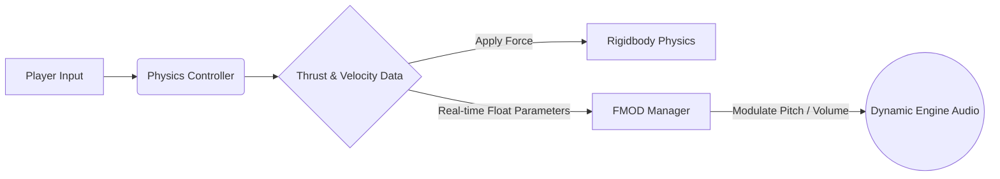

# 🌕 Lunar Lander | Physics & FMOD Audio Integration

**Lunar Lander** is a precision-based arcade simulator focusing on inertia, gravity manipulation, and sensory feedback. 

⚠️ **Note on my contribution:** *My role in this project was strictly focused on **Software Engineering**. I was entirely responsible for programming all gameplay mechanics, physics interactions, game state logic, and the technical integration of the dynamic audio system using FMOD.*

## 🏗️ System Architecture: The Audio-Physics Bridge

The core challenge of this project was creating a tangible sense of "weight" and "danger." To achieve this, the physics engine and the audio engine are tightly coupled through data, ensuring that every input has an immediate, mathematically accurate sensory reaction.

## 🛠️ Technical Highlights
### 1. FMOD Dynamic Audio Integration
Standard Unity AudioSource components are often insufficient for professional game audio. I implemented a dedicated FMODManager to handle complex audio events:
- **Parameter Mapping:** Instead of playing static looping clips, the engine sound is a continuous FMOD event. The code actively maps the exact magnitude of the thruster's force to FMOD parameters (like pitch and volume) in real-time.
- **Audio State Management:** Clean handling of audio lifecycles (Play, Stop, Release) to prevent memory leaks and ensure audio events match the active game state perfectly.

### 2. Precision Physics Controller
Handling a lunar lander requires deterministic-like control and a deep understanding of Unity's physics lifecycle:
- **Inertia & Gravity:** Custom implementation of constant forces and gravitational acceleration inside the FixedUpdate loop to guarantee frame-independent physics resolution.
- **Fuel Consumption Logic:** A decoupled system that accurately tracks resource depletion while updating the UI and modifying the ship's physical capabilities dynamically.

### 3. Decoupled Game Logic
- **Event-Driven States:** The Win/Lose conditions (WinAndLose.cs) are handled through a clean, event-driven approach. The ship doesn't need to know what happens when it crashes; it just broadcasts the crash event, and the manager handles the UI and level resets.

## 📂 Project Structure
- /Scripts/Audio: Contains the FMODManager and specific event triggers.
- /Scripts/Core: Physics controllers, input reading, and fuel management.
- /Scripts/UI: Event listeners that update HUD elements based on the ship's telemetry.

## 👨‍💻 Author

  
  <h4>Jesús Carrero - Unity Gameplay Engineer</h1>
  

